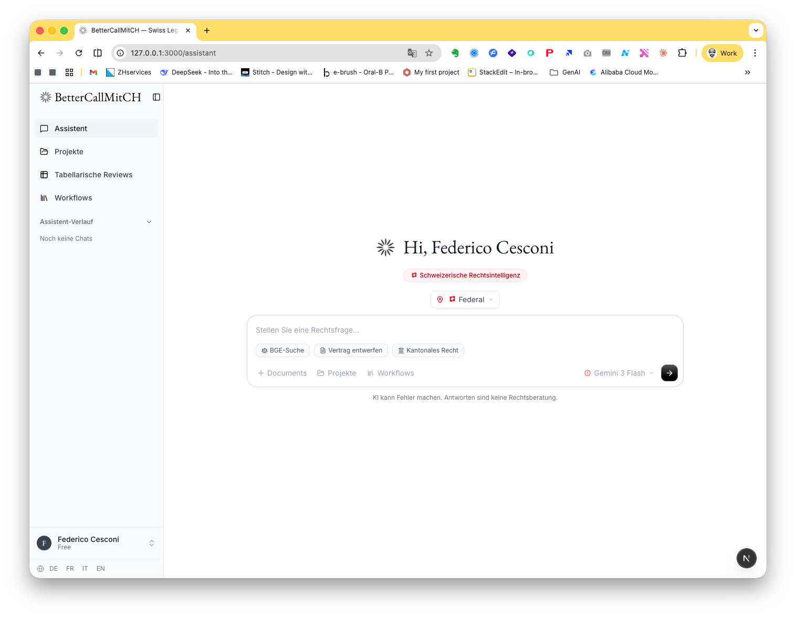
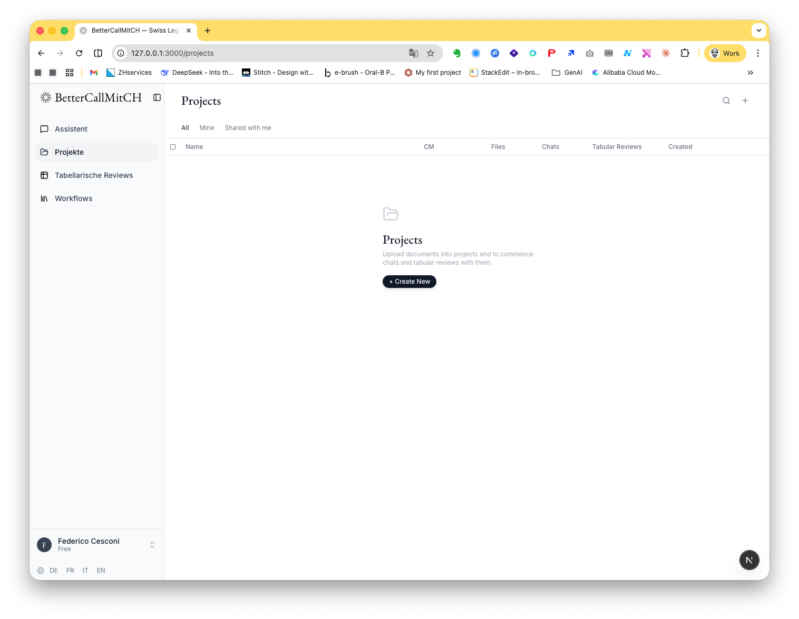
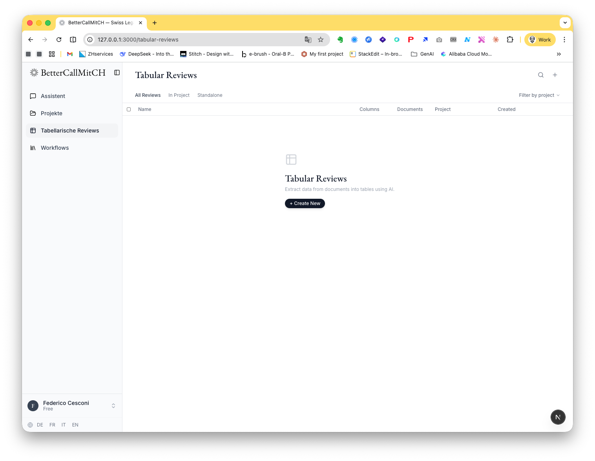
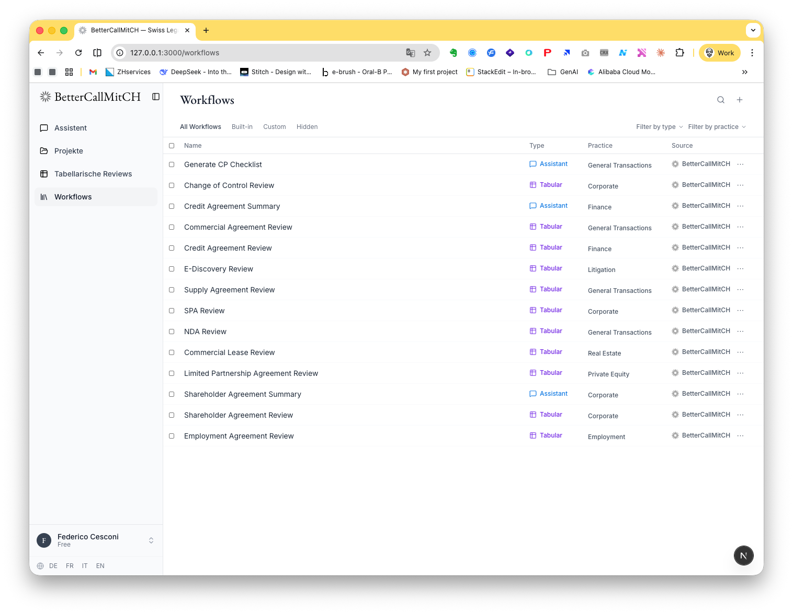
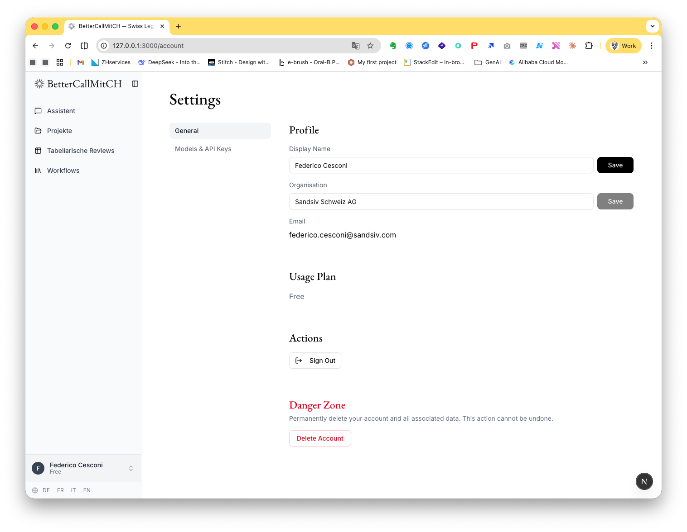
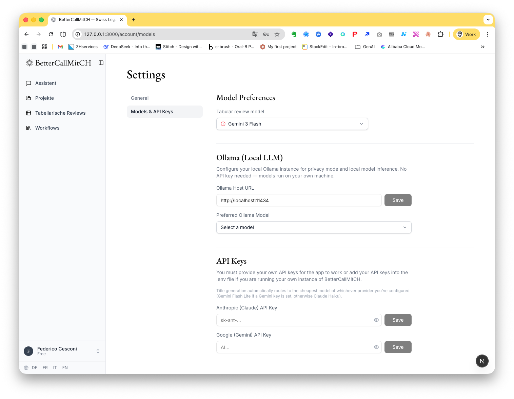

<div align="center">

# ⚖️ BetterCallMitCH — Swiss Legal Intelligence

**AI-powered legal research, document analysis, and contract review for the Swiss legal market.**

Built on the [BetterCallClaude](https://github.com/fedec65/bettercallclaude) engine, localized for all 26 Swiss cantons and 4 national languages.

[](https://nextjs.org)
[](https://expressjs.com)
[](https://supabase.com)
[](backend/src)
[](frontend/e2e)
[](LICENSE)

</div>

---

## 📸 Screenshots

### 💬 AI Legal Assistant
Swiss legal intelligence chat with canton-aware context, multi-language support, model selection (Claude, Gemini, or local Ollama), and document attachments.



### 📁 Projects & Document Management
Organize documents into projects, collaborate on chats and tabular reviews, and share with your team.



### 📊 Tabular Reviews
Extract structured data from documents into tables using AI. Ideal for due diligence, contract review, and legal analysis.



### ⚙️ Built-in Workflows
20+ pre-configured legal workflows covering corporate, litigation, finance, real estate, and employment law.



### 🔐 Settings & API Configuration
Personal profile, organization settings, model preferences, and per-provider API key management.



### 🦙 Local Ollama Integration
Run models locally for maximum privacy. Configure your Ollama host and select from any pulled model.



---

## ✨ Features

### 🏔️ Swiss Legal Intelligence
- **BGE/ATF/DTF Research** — Search Federal Supreme Court decisions
- **Cantonal Court Search** — All 26 cantonal and federal courts
- **Citation Verification** — Cross-convert citations across DE/FR/IT/EN
- **Federal Legislation (Fedlex)** — Query statutes via SPARQL
- **Legal Commentaries (Kommentare)** — Access Swiss legal commentary
- **Case Strategy & Document Drafting** — In all 4 national languages
- **Compliance Analysis** — OR, ZGB, DSG, FINMA circulars

### 🤖 AI Models
- **Claude** (Opus, Sonnet, Haiku) via Anthropic API
- **Gemini** (Pro, Flash, Flash Lite) via Google API
- **Ollama** (local) — any pulled model, dynamically discovered
- **Per-message model selection** — switch models mid-conversation
- **Privacy strict mode** — force local Ollama for sensitive queries

### 📄 Document Processing
- Upload DOCX, PDF, and other formats
- AI-powered document analysis and extraction
- Tracked changes in DOCX (redline mode)
- Document versioning and sharing

### 🌍 Multi-Language
- **German (DE), French (FR), Italian (IT), English (EN)**
- Full UI localization with `next-intl`
- Cookie-based locale switching (no URL prefixes)
- Swiss legal terminology in all languages

### 🛡️ Privacy & Compliance
- **Anwaltsgeheimnis scanning** — Automatic privilege detection (Art. 321 StGB / Art. 13 BGFA)
- **Privacy modes** — Standard, Balanced, Strict (forces local Ollama)
- **Per-user API keys** — No centralized key storage
- **Gutachtenstil reasoning** — Three-step legal analysis (Obersatz / Untersatz / Schluss)

### ⚡ Workflows
Built-in workflows for common Swiss legal tasks:
- Swiss Litigation Preparation (Klageschrift)
- Swiss Contract Review (OR compliance)
- Swiss Due Diligence (corporate, regulatory, employment, real estate)
- Swiss Legal Opinion (Gutachten)
- Swiss Compliance Check (FINMA, GwG, nDSG)
- And 15+ more...

---

## 🏗️ Architecture

```
┌─────────────────┐      ┌─────────────────┐      ┌─────────────────┐
│   Next.js 16    │◄────►│  Express API    │◄────►│   Supabase      │
│   (Frontend)    │      │  (Backend)      │      │  (Auth + DB)    │
│   Port 3000     │      │  Port 3001      │      │  Port 54321     │
└─────────────────┘      └─────────────────┘      └─────────────────┘
        │                        │
        │                        ▼
        │               ┌─────────────────┐
        │               │  MCP Servers    │
        │               │  (BetterCall    │
        │               │   Claude)       │
        │               └─────────────────┘
        │                        │
        ▼                        ▼
┌─────────────────┐      ┌─────────────────┐
│  Ollama (Local) │      │  Claude / Gemini│
│  Port 11434     │      │  (Cloud APIs)   │
└─────────────────┘      └─────────────────┘
```

| Component | Technology |
|-----------|------------|
| **Frontend** | Next.js 16 (App Router), React 19, Tailwind CSS, Radix UI |
| **Backend** | Express 4, TypeScript, tsx (dev) |
| **Database** | Supabase (Postgres + Auth) |
| **Storage** | S3-compatible (Cloudflare R2 / MinIO) |
| **Testing** | Vitest (backend), Playwright (E2E) |
| **i18n** | next-intl (DE, FR, IT, EN) |

---

## 🚀 Quick Start

### Prerequisites
- [Node.js](https://nodejs.org) 20+
- [Docker](https://docker.com) (for local Supabase)
- [Supabase CLI](https://supabase.com/docs/guides/cli)
- (Optional) [Ollama](https://ollama.com) for local models

### 1. Clone & Install

```bash
git clone https://github.com/fedec65/bettercallmitch.git
cd bettercallmitch
npm install --prefix backend
npm install --prefix frontend
```

### 2. Start Local Supabase

```bash
npx supabase start
```

This starts Postgres, Auth, Storage, and Studio locally.

### 3. Configure Environment

```bash
cp backend/.env.example backend/.env
cp frontend/.env.local.example frontend/.env.local
```

The local Supabase credentials are auto-populated. Add at least one LLM API key:

```bash
# backend/.env
ANTHROPIC_API_KEY=sk-ant-...     # for Claude
# or
GEMINI_API_KEY=AI...              # for Gemini
```

### 4. Start the Services

```bash
# Terminal 1: Backend
cd backend && npm run dev

# Terminal 2: Frontend
cd frontend && npm run dev

# Terminal 3: Ollama (optional)
ollama serve
```

Open http://localhost:3000 🎉

---

## 🧪 Testing

```bash
# Backend unit tests (43 tests)
cd backend && npm run test

# Frontend E2E tests (3 tests, headless)
cd frontend && npx playwright test

# Build verification
cd backend && npm run build
cd frontend && npm run build
```

---

## 📁 Project Structure

```
bettercallmitch/
├── backend/
│   ├── src/
│   │   ├── lib/
│   │   │   ├── agents/          # 20 legal agent personas
│   │   │   ├── llm/             # Claude, Gemini, Ollama providers
│   │   │   ├── mcp/             # MCP server client & tools
│   │   │   ├── chatTools.ts     # Chat orchestration
│   │   │   ├── privacy.ts       # Anwaltsgeheimnis scanner
│   │   │   └── storage.ts       # S3/R2 document storage
│   │   ├── routes/              # API routes
│   │   └── index.ts             # Express app entry
│   ├── migrations/              # SQL migrations
│   └── tests/                   # Vitest test suite
├── frontend/
│   ├── src/
│   │   ├── app/                 # Next.js App Router pages
│   │   ├── components/          # UI components
│   │   ├── contexts/            # React contexts (Auth, Profile)
│   │   ├── hooks/               # Custom hooks
│   │   └── lib/                 # API client, utilities
│   ├── messages/                # i18n translations (de, fr, it, en)
│   └── e2e/                     # Playwright tests
└── supabase/
    └── migrations/              # Supabase CLI migrations
```

---

## 🔌 MCP Servers

BetterCallMitCH connects to 7 remote MCP servers hosted in the EU:

| Server | Purpose |
|--------|---------|
| `search_bge` | Federal Supreme Court decisions |
| `search_swiss_decisions` | Cantonal & federal court search |
| `verify_citation` | Citation cross-verification |
| `search_federal_legislation` | Fedlex SPARQL queries |
| `search_commentary` | Swiss legal commentaries |
| `legal_strategy` | Litigation strategy generation |
| `legal_draft` | Contract & opinion drafting |

See `backend/src/lib/mcp/client.ts` for the full registry.

---

## 📄 License

AGPL-3.0-only. See [LICENSE](LICENSE).

---

<div align="center">

Made with ❤️ in 🇨🇭 Switzerland

</div>
